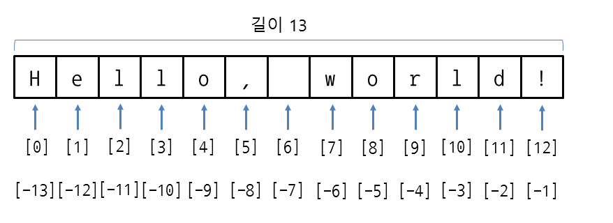

# python_learning
## 함수
함수는

함수이름(인수)

이런식으로 사용한다 인수로는 표현식을 넘겨줄 수 있다 그리고 또한 인수를 여러개 넘겨주는 것 또한 가능하다

예시로 가장 기본적인 print()함수를 알아보자면
```python
print(123)
#123을 출력함
a = 10101
print(a)
#a라는 변수를 출력하는데 변수 a의 값은 10101이니 10101을 출력함
```

그리고 반환과 출력을 잘 구분하도록하자 함수들은 대부분 값을 반환하고 출력하지는 않는다
## 변수
변수는 변수명 = 표현식 이런식으로 선언함

변수이름은 만드는 규칙이 있다 외우도록 하자
+ 한글이나 영문 또는 _로 시작할 수 있음
+ 변수명은 영어 대소문자를 구분함
+ 변수명은 숫자부터 시작할 수 없음
+ 변수명은(_제외) 특수문자를 사용할 수 없음
+ 변수명은 띄어쓰기를 사용할 수 없음
+ 키워드는 변수명으로 사용불가

이때 표현식은

"표현식(expression) : 값, 변수, 연산자의 조합. 값이나 변수 그자체로 표현식으로 취급되기도 한다."

```python
a = 1
b = '1abc'
d = "Abcd"
e = True
d = False
```

그리고 type()이라는 함수는 인수로 넘겨받은 값의 자료형을 반환함
```python
a = 123
print(type(a))
#출력은 int
b = "abd"
print(type(b))
#출력은 str
```

## 연산자
### 산술연산
더하기: +

빼기: -
곱하기: *

나누기: /

몫: //

나머지: %

제곱: **

함수이긴 하지만 abs(숫자형 값) --> 절대값

```python
print(1 + 1)
#출력은 2
print(1 - 1)
#출력은 0
print(1 * 2)
#출력은 2
print(2 / 1.4)
#출력은 1.4285714285714286
print(2 // 1.4)
#출력은 1
print(3 % 2)
#출력은 1
print(3**2)
#출력은 9
```

### 문자열 연산
문자열에도 연산자를 사용할 수 있음

```python
print("Hello" + "Goodbye") #이어붙이기
#출력은 HelloGoodbye
print("Hi" * 3) #곱한 만큼 문자열을 반복
#출력은 HiHiHi
```

## 인덱서
### 문자열 인덱싱
a = "Hello, World!"라고 할 때

a[숫자] 형식으로 숫자의 위치에 맞는 문자를 가져올 수 있음

예시)
```python
a = "Hello, World!"
a[0] #--> 'H' 
a[1] #--> 'e'
a[2] #--> 'l'
```
컴퓨터는 숫자를 0부터 세기 때문에 익덱서(대괄호 부분을 인덱서라고 함)에 0을 집어넣으면 문자열의 우리가 생각하는 1번째 문자를 반환함

이 개념은 시험에 나올 가능성이 상당히 높음

### 문자열 슬라이싱
a = "Hello, World!"라고 할 때

```python
a = "Hello, World!"
a[0:] #--> "Hello, World!" 0: 는 0부터 끝까지라는 뜻이다
a[4:] #--> "o, World!" 4번째부터 끝까지
```
반대로 [:4] 이런식으로 쓰게 되면 처음부터 4번째 앞까지라는 뜻이다 --> "Hell"

```python
a[:4] #--> "Hell"
```


## 배열
배열은 수학의 집합과 비슷하다 하지만 중복이 가능한 점에서 다르다 선생님의 설명을 보면
- 어떤 자료형의 값이든 리스트의 원소로 이용 가능
- 리스트이름[번호]로 각 원소 이용 가능
- 각각의 원소는 다른 자료형을 가질 수 있음

이라고 되어있는데 어떤 자료형의 값이든이라는 부분에서 리스트 안에 리스트가 존재할 수 있다는 것을 알아야 한다(이것은 2차원 배열이라고 하는데 시험범위는 아닐 것이다)

배열을 선언하는 방법은
```python
a = [1, 2, 3, 4, "a"]
b = []
```
가 있다

그리고 배열에도 아까 설명한 인덱스를 적용할 수 있다
```python
a = [1, 2, 3, 4]
a[1] #--> 2
```

배열을 수정하는 방법은 인덱서를 이용해 수정할 수 있다
```python
a = [1, 2, 3, 4, "a"]
a[2] = 10 #이것은 a의 2번째 값을 10으로 바꾼 것이다
```

### 배열의 내장 함수
내장 함수가 무엇인지는 알 필요 없다 리스트형 변수의 뒤에 .를 붙이고 함수명을 붙여서 사용할 수 있다는 것만 알면 된다.

예시)
```python
a = [1, 2, 3, 4, 4]
a.append("a")
a.insert(2, 'd')
```

종류와 기능으로는

```python
a = [1, 3, 2, 4, 4, 5, 5]
a.append("a") #배열의 맨 끝에 인수로 받은 값을 추가함
a.insert(2, 'd') #첫번째 인수로 받은 위치에 2번째 인수로 받은 값을 추가함
a.sort() #배열을 정렬함 a의 경우 [1, 2, 3, 4]로 정렬 됌
a.index(4) #인수로 넘겨받은 값이 발견되는 첫번째와 가장 가까운 값은 반환함 이경우에는 3
a.reverse() #배열을 뒤집음 [1, 2, 3]이라면 [3, 2, 1]로
a.pop() #배열의 맨 처음 값을 반환하고 삭제 함
a.remove(5) #인수로 받은 값과 동일한 값 중 맨 앞의 값을 삭제 함
a.count(4) #해당 배열에서 인수로 넘겨받은 값과 동일한 값의 개수를 반환함 이 경우에는 2
a.extend([1, 2, 3]) #해당 리스트 뒤에 넘겨받은 리스트를 이어붙임
```
